# Installation Documentation

## Step 1: Installing Python

### 1.1. Configure Windows to allow Long Paths

- follow [these instructions](https://www.tenforums.com/tutorials/51704-enable-disable-win32-long-paths-windows-10-a.html)

- eliminates possible issues later with long file paths in Python

### 1.2. Download the Python installer

- The installer is located at: [https://www.python.org/downloads/release/python-382/](https://www.python.org/downloads/release/python-382/)

- Scroll to the bottom of the page and select: **Windows x86-64 executable installer**

### 1.3. Run the Python Installer

- The Python install settings are user preference, but it is recommended to follow the pictures below:

    

    

- By installing to `C:\Program Files\Python38`, the python files will be in a clear, easy-to-reach directory:

    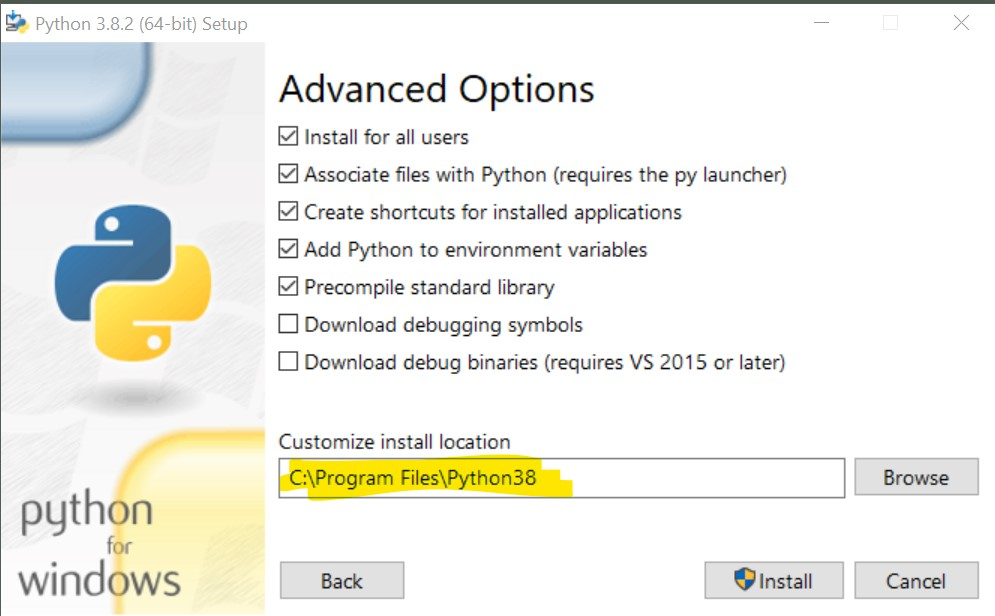

### 1.4. Configure the Windows Environmental Variables

- The environmental variables should have been set correctly by the Python installer, but it is good to get familiar
with the Environmental Variables gui.

- The pictures below show the steps for manipulating the environmental variables:

    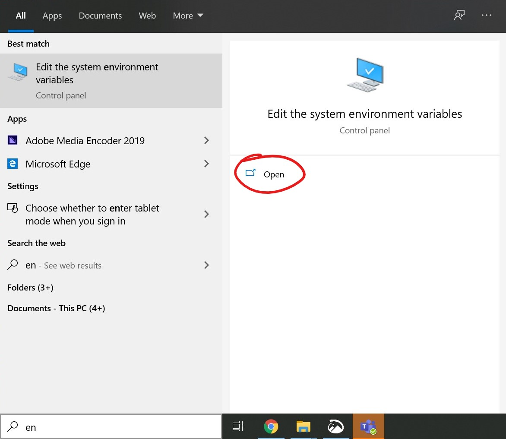

    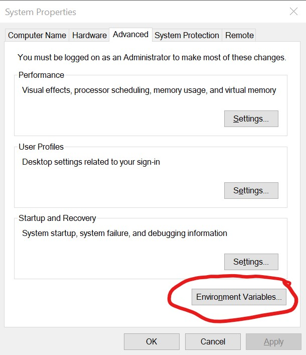

    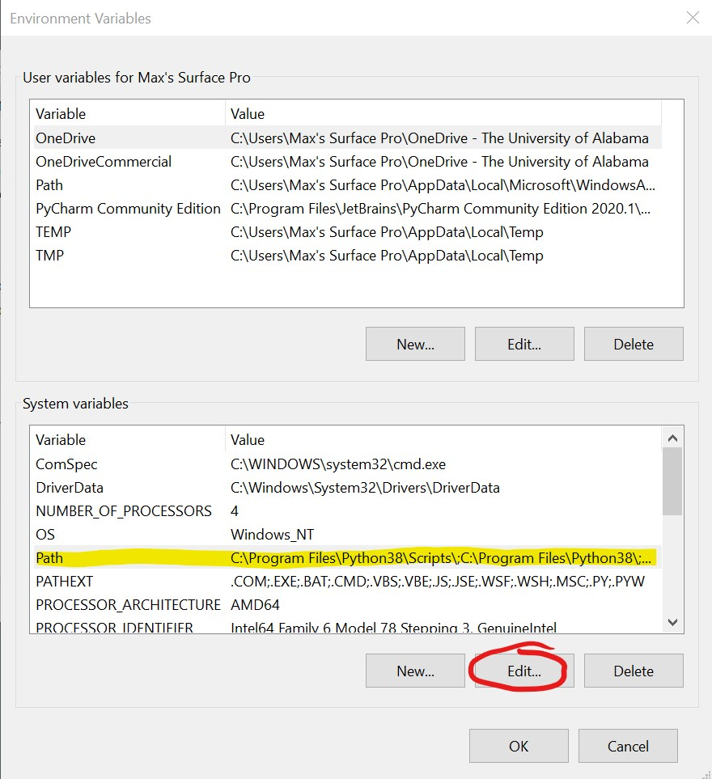

- The highlighted directories (or instead your Python directory, which you specified during Step 3.)
should be in your Path. If not, add them and click Ok.

    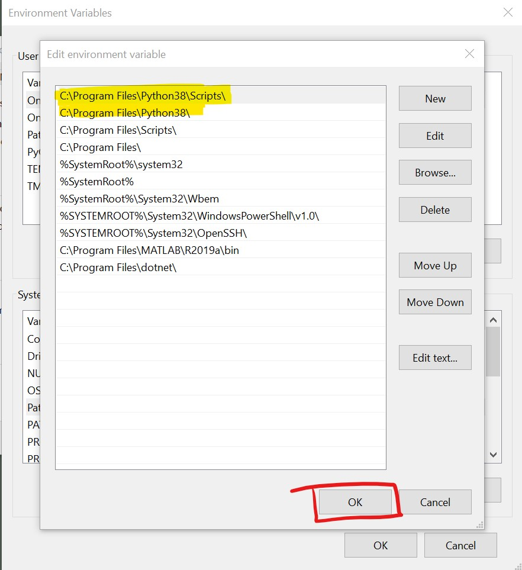

- To verify that the Python directory is in the Windows Path, we will open up the Windows command line and
simply type `python`. Your command should be recognized like below:

    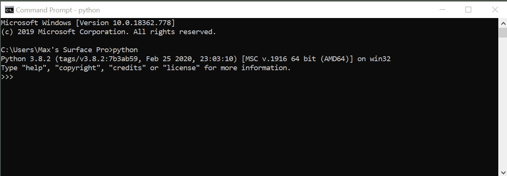

## Step 2. Install Git for Windows

### Option A
### 2.1 Download the Git Installer

- [https://git-scm.com/download/win](https://git-scm.com/download/win)

### 2.2 Run the installer

- Stick with the default settings

### Option B
### 2.1 Continue onto Step 3 and download Git via PyCharm

- When trying to open a repository, PyCharm will prompt in the bottom-right corner that Git is not installed.
Click the button to install Git.

## Step 3. Installing PyCharm

**You should have already setup a Github account, and be upgraded to Github education if possible.**

### 3.1 Downloading the PyCharm Installer

- Link to the installer: [https://www.jetbrains.com/pycharm/download/#section=windows](https://www.jetbrains.com/pycharm/download/#section=windows)

- If you have a GitHub Pro **student** account, you are eligible for PyCharm Professional Account.
    - Go to [https://www.jetbrains.com/shop/eform/students](https://www.jetbrains.com/shop/eform/students) and
    apply with your GitHub account. After the account verification steps, you will be able to use PyCharm Professional

- Otherwise, download the PyCharm Community Edition.

### 3.2 Installing PyCharm

- Follow the instructions for PyCharm setup. You will likely want to change the display settings in the future

### 3.3 Cloning the US69 repository via PyCharm
- Once the screen below appears, it is time to clone this repository to your machine!:

    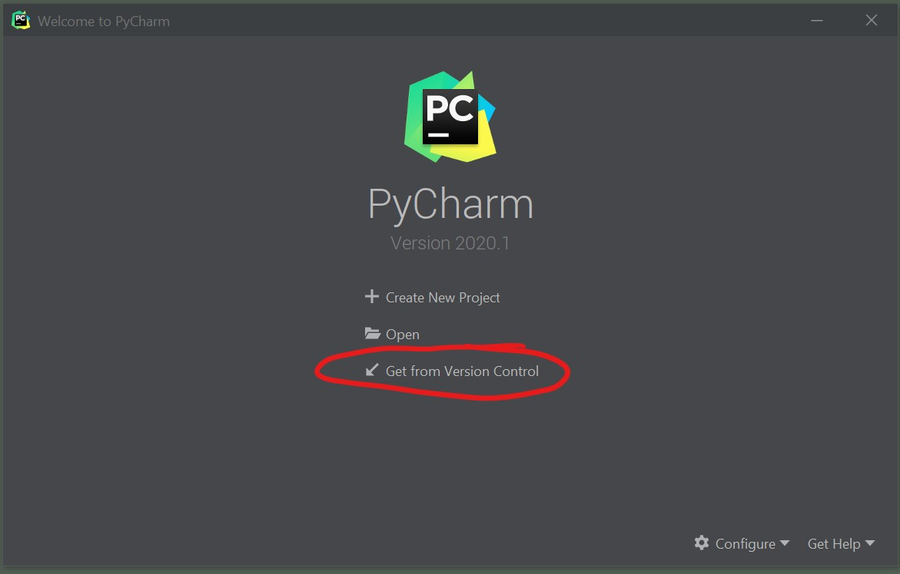

- Select "Get from Version Control" and login to your GitHub account.
Then select the US69 repository from your list of repositories.
    - If the US69 repository does not show up contact Max Schrader (mcschrader@crimson.ua.edu) to be added to the repository.

- The location of the repository is personal preference:

    

- Select Clone and download the repository.

### 3.4 Setting up a virtual environment

- A virtual environment is used to "separate" python packages and python versions. When working on a project like US69,
it is useful to setup a virtual environment so that you don't run into conflicting package issues with other
Python projects that you might be working on.

- Navigate to File -> Settings and select the Gear -> Add:

    

- Setup the virtual environment like below (the file location should default to your repository root. This is correct):

    

- After the virtual environment is set up, the required Python packages for the US69 repository need to be installed.
Navigate to the Terminal like the picture below and type `pip install -r requirements.txt` into the PyCharm terminal

    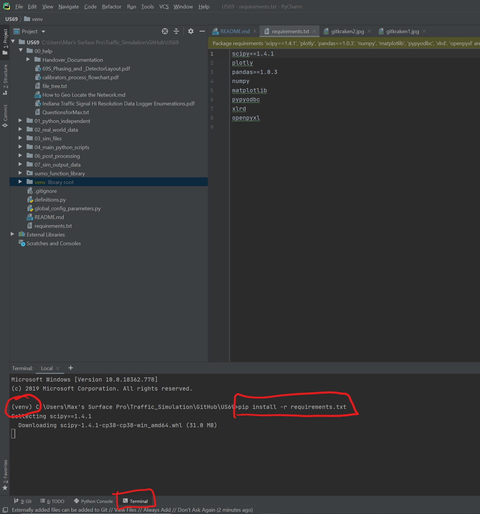

**Side Note**: the Terminal in PyCharm is a useful tool. It automatically defaults to the US69 directory and
the virtual environment.

#### Understanding PyCharm file colors:
 Go to below for a description of what your PyCharm Theme colors mean (Inside of PyCharm):

 File | Settings | Version Control | File Status Colors


## Step 4 Installing GitKraken

### 4.1 Downloading GitKraken

- Download the installer from their website [https://www.gitkraken.com/download](https://www.gitkraken.com/download)

- It is recommended to watch the first couple videos in GitKraken's playlist
[https://www.youtube.com/playlist?list=PLe6EXFvnTV7-_41SpakZoTIYCgX4aMTdU](https://www.youtube.com/playlist?list=PLe6EXFvnTV7-_41SpakZoTIYCgX4aMTdU)

### 4.2 Setting up the repo

- Run the installer

- When the window below appears, select the "Open a repo" option

    

- Once the screen below appears, navigate to your local copy of the US69 Repository and open it up.

    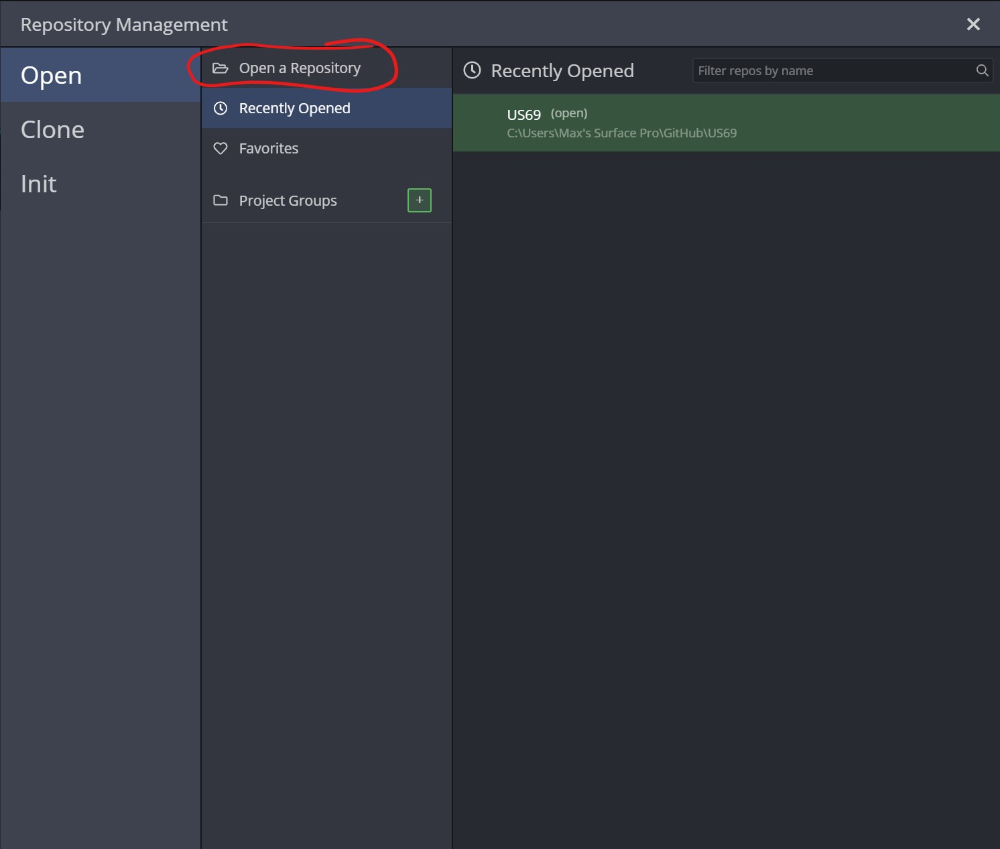

### 4.3 Configuring a commit template

- A Git commit template is a tool for maintaining standardized and informative commit messages.

- To add the US69 git commit template to your GitKraken, navigate to your US69
repository file location and display hidden files like below:

    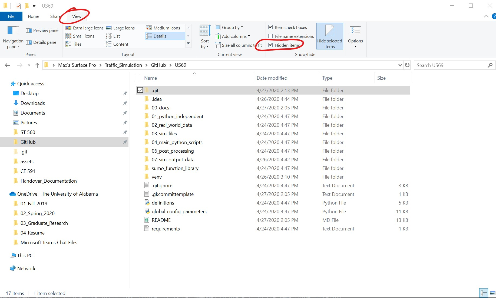

- Navigate to your .git folder and open the "config" file

- Append the following text onto the bottom of the file:

```
[commit]
	template = ./.gkcommittemplate.txt
```

- Save and close the "config" file

- Inside of GitKraken navigate to File | Preferences | Commit Template

- Verify that the text boxes are populated. If so, check the box that says
"Remove comments from commit messages"


### 4.4 Helpful GitKraken Settings:

- Change the avatar display to user initial display in File | Preferences | UI Preferences

## Step 5 Installing SUMO

### 5.1 Downloading the most recent build

- Go to the SUMO download page: [https://sumo.dlr.de/docs/Downloads.php#sumo_-_latest_development_version](https://sumo.dlr.de/docs/Downloads.php#sumo_-_latest_development_version)
and install the highlight **.zip** file:

    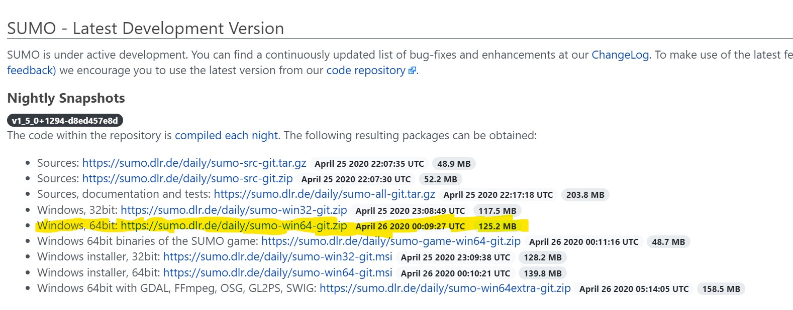

### 5.2 Extract the SUMO files

- Once the zip file has downloaded, extract it to a location of your choice. It is recommended to place it in the same folder location
as you US69 repository, such as `C:\Users\<user name>\Traffic_Simulation\`, where `Traffic_Simulation\` houses the US69 repository and
you sumo download.

### 5.3 Adding the SUMO file locations to the environmental variables

- Now that SUMO has been extracted, the environmental variables need to be manipulated.

- Navigate to the Environmental Variables window like Step 1.4.

- Open the **Path** variable in the User variables like below:

    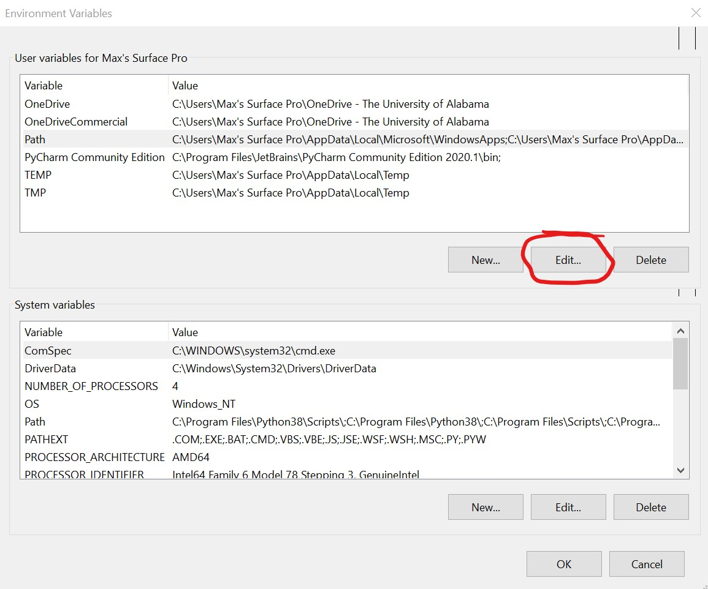

- Add the location to the **bin** folder in your SUMO directory like below and hit "okay":

    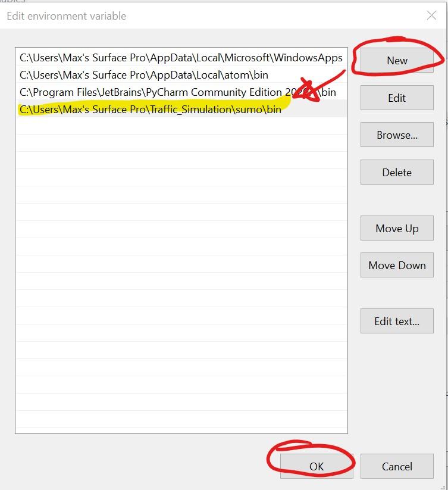

- Create a new environmental variable called **SUMO_HOME** and add the location to your SUMO directory like below:

    

### 5.4 Check that the environmental variables are set correctly

- Check that your environmental variables are set correctly by typing `sumo` into the Command Prompt. If the command is
recognized, then your environmental variables are correct

    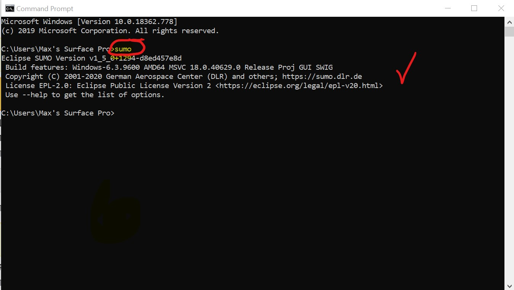
    
### Updating SUMO

- You just downloaded the latest version of SUMO, however, if you wish to update SUMO in the future, it is a simple as
placing the new sumo folder in the same location as the old, with the same name.

- Watch the SUMO users forum for SUMO updates to determine if a newer version should be installed

## Step 6 Installing Jupyter Notebook

Jupyter Notebook is a good tool for doing data analysis, and is used in the simulation output analysis scrips.

### 6.1 Installing Jupyter Notebook wih pip

- Run `pip install jupyter notebook` in the PyCharm terminal

### 6.2 Launching Jupyter Notebook

- Type `jupyter notebook` into the Terminal. That simple!

### 6.3 Setting up Jupyter Notebook with Extensions

- Out of the box, Jupyter Notebook does not have many of the extensions that you will come to enjoy
in PyCharm.

- To enable and configure extensions, follow the instructions in this Medium post:
[https://towardsdatascience.com/jupyter-notebook-extensions-517fa69d2231](https://towardsdatascience.com/jupyter-notebook-extensions-517fa69d2231)

- **remember to use the PyCharm Terminal when using `pip`**
